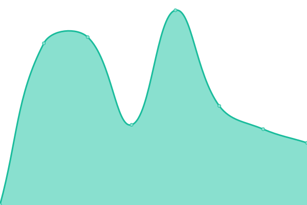
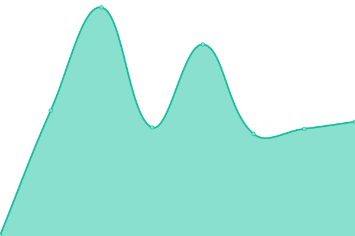
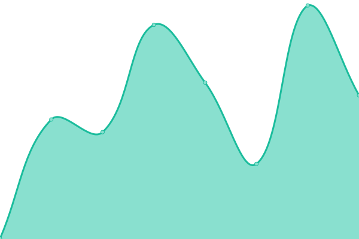
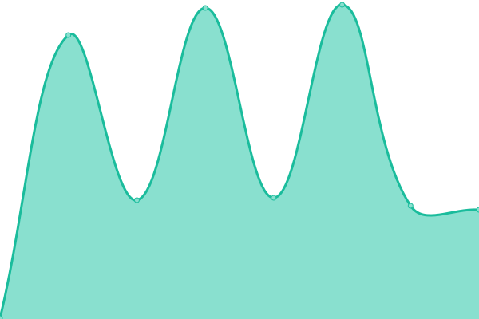
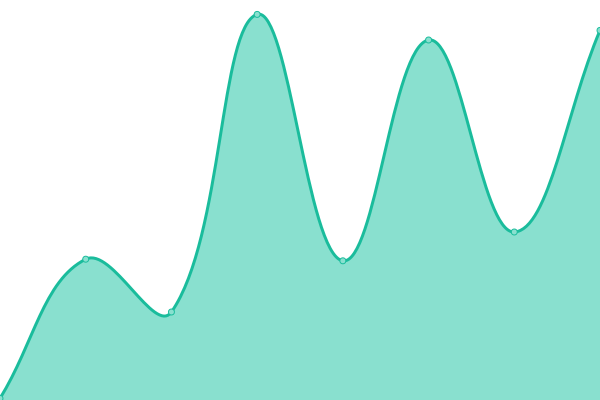
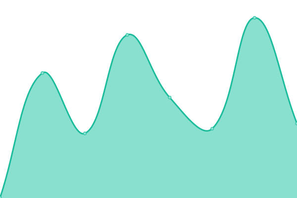

# [📈 Live Status](https://Vulpine-Solutions.github.io/upptime): <!--live status--> **🟩 All systems operational**

This repository contains the open-source uptime monitor and status page for [Vulpine Solutions](https://vulpinesolutions.net), powered by [Upptime](https://github.com/upptime/upptime).

With [Upptime](https://upptime.js.org), you can get your own unlimited and free uptime monitor and status page, powered entirely by a GitHub repository. We use [Issues](https://github.com/Vulpine-Solutions/upptime/issues) as incident reports, [Actions](https://github.com/Vulpine-Solutions/upptime/actions) as uptime monitors, and [Pages](https://Vulpine-Solutions.github.io/upptime) for the status page.

<!--start: status pages-->
<!-- This summary is generated by Upptime (https://github.com/upptime/upptime) -->
<!-- Do not edit this manually, your changes will be overwritten -->
<!-- prettier-ignore -->
| URL | Status | History | Response Time | Uptime |
| --- | ------ | ------- | ------------- | ------ |
|  [Becoming Me](https://becoming.client.vulpinesolutions.net) | 🟩 Up | [becoming-me.yml](https://github.com/Vulpine-Solutions/upptime/commits/HEAD/history/becoming-me.yml) | 

 454ms
     
 | 

<a href="https://Vulpine-Solutions.github.io/upptime/history/becoming-me">100.00%</a>
    

|  [Carepoint Inc](https://carepoint.client.vulpinesolutions.net) | 🟩 Up | [carepoint-inc.yml](https://github.com/Vulpine-Solutions/upptime/commits/HEAD/history/carepoint-inc.yml) | 

 600ms
     
 | 

<a href="https://Vulpine-Solutions.github.io/upptime/history/carepoint-inc">100.00%</a>
    

|  [Church of Hope](https://hopeinocala.client.vulpinesolutions.net) | 🟩 Up | [church-of-hope.yml](https://github.com/Vulpine-Solutions/upptime/commits/HEAD/history/church-of-hope.yml) | 

 657ms
     
 | 

<a href="https://Vulpine-Solutions.github.io/upptime/history/church-of-hope">100.00%</a>
    

|  [Grand Harbor](https://grandharbor.client.vulpinesolutions.net) | 🟩 Up | [grand-harbor.yml](https://github.com/Vulpine-Solutions/upptime/commits/HEAD/history/grand-harbor.yml) | 

 464ms
     
 | 

<a href="https://Vulpine-Solutions.github.io/upptime/history/grand-harbor">100.00%</a>
    

|  [Grand Strand Charter Arts](https://gsca.client.vulpinesolutions.net) | 🟩 Up | [grand-strand-charter-arts.yml](https://github.com/Vulpine-Solutions/upptime/commits/HEAD/history/grand-strand-charter-arts.yml) | 

 873ms
     
 | 

<a href="https://Vulpine-Solutions.github.io/upptime/history/grand-strand-charter-arts">100.00%</a>
    

|  [Gretel Uys](https://greteluys.client.vulpinesolutions.net) | 🟩 Up | [gretel-uys.yml](https://github.com/Vulpine-Solutions/upptime/commits/HEAD/history/gretel-uys.yml) | 

 422ms
     
 | 

<a href="https://Vulpine-Solutions.github.io/upptime/history/gretel-uys">100.00%</a>
    

|  [GrowCo Lab](https://growcolab.client.vulpinesolutions.net) | 🟩 Up | [grow-co-lab.yml](https://github.com/Vulpine-Solutions/upptime/commits/HEAD/history/grow-co-lab.yml) | 

 473ms
     
 | 

<a href="https://Vulpine-Solutions.github.io/upptime/history/grow-co-lab">100.00%</a>
    

|  [Maranatha](https://maranatha.client.vulpinesolutions.net) | 🟩 Up | [maranatha.yml](https://github.com/Vulpine-Solutions/upptime/commits/HEAD/history/maranatha.yml) | 

 478ms
     
 | 

<a href="https://Vulpine-Solutions.github.io/upptime/history/maranatha">100.00%</a>
    

|  [Mark D. Cummins](https://markdcummins.client.vulpinesolutions.net) | 🟩 Up | [mark-d-cummins.yml](https://github.com/Vulpine-Solutions/upptime/commits/HEAD/history/mark-d-cummins.yml) | 

 1200ms
     
 | 

<a href="https://Vulpine-Solutions.github.io/upptime/history/mark-d-cummins">100.00%</a>
    

|  [Monkey's Bar](https://monkeysbar.client.vulpinesolutions.net) | 🟩 Up | [monkey-s-bar.yml](https://github.com/Vulpine-Solutions/upptime/commits/HEAD/history/monkey-s-bar.yml) | 

 479ms
     
 | 

<a href="https://Vulpine-Solutions.github.io/upptime/history/monkey-s-bar">100.00%</a>
    

|  [Phoenix Construction Group](https://phoenixconstruction.client.vulpinesolutions.net) | 🟩 Up | [phoenix-construction-group.yml](https://github.com/Vulpine-Solutions/upptime/commits/HEAD/history/phoenix-construction-group.yml) | 

 494ms
     
 | 

<a href="https://Vulpine-Solutions.github.io/upptime/history/phoenix-construction-group">100.00%</a>
    

|  [Seas the Day Travel](https://seastheday.client.vulpinesolutions.net) | 🟩 Up | [seas-the-day-travel.yml](https://github.com/Vulpine-Solutions/upptime/commits/HEAD/history/seas-the-day-travel.yml) | 

 475ms
     
 | 

<a href="https://Vulpine-Solutions.github.io/upptime/history/seas-the-day-travel">100.00%</a>
    

|  [Shane Tanzosh](https://shanetanzosh.client.vulpinesolutions.net) | 🟩 Up | [shane-tanzosh.yml](https://github.com/Vulpine-Solutions/upptime/commits/HEAD/history/shane-tanzosh.yml) | 

 422ms
     
 | 

<a href="https://Vulpine-Solutions.github.io/upptime/history/shane-tanzosh">100.00%</a>
    

|  [The Conference Center](https://cc.client.vulpinesolutions.net) | 🟩 Up | [the-conference-center.yml](https://github.com/Vulpine-Solutions/upptime/commits/HEAD/history/the-conference-center.yml) | 

 495ms
     
 | 

<a href="https://Vulpine-Solutions.github.io/upptime/history/the-conference-center">100.00%</a>
    

|  [Touch of Class Concierge](https://touchofclass.client.vulpinesolutions.net) | 🟩 Up | [touch-of-class-concierge.yml](https://github.com/Vulpine-Solutions/upptime/commits/HEAD/history/touch-of-class-concierge.yml) | 

 439ms
     
 | 

<a href="https://Vulpine-Solutions.github.io/upptime/history/touch-of-class-concierge">100.00%</a>
    

|  [UTurn Consulting](https://uturn.client.vulpinesolutions.net) | 🟩 Up | [u-turn-consulting.yml](https://github.com/Vulpine-Solutions/upptime/commits/HEAD/history/u-turn-consulting.yml) | 

 472ms
     
 | 

<a href="https://Vulpine-Solutions.github.io/upptime/history/u-turn-consulting">100.00%</a>
    

|  [VS MainWP](https://clients.vulpinesolutions.net) | 🟩 Up | [vs-main-wp.yml](https://github.com/Vulpine-Solutions/upptime/commits/HEAD/history/vs-main-wp.yml) | 

 398ms
     
 | 

<a href="https://Vulpine-Solutions.github.io/upptime/history/vs-main-wp">100.00%</a>
    

|  [Vulpine Solutions](https://vulpinesolutions.net) | 🟩 Up | [vulpine-solutions.yml](https://github.com/Vulpine-Solutions/upptime/commits/HEAD/history/vulpine-solutions.yml) | 

 79ms
     
 | 

<a href="https://Vulpine-Solutions.github.io/upptime/history/vulpine-solutions">100.00%</a>
    

|  [Wallace Success](https://wallacesuccess.com/) | 🟩 Up | [wallace-success.yml](https://github.com/Vulpine-Solutions/upptime/commits/HEAD/history/wallace-success.yml) | 

 289ms
     
 | 

<a href="https://Vulpine-Solutions.github.io/upptime/history/wallace-success">100.00%</a>
    

|  [Valorous - 3CX](https://lifecrest.3cx.us) | 🟩 Up | [valorous-3-cx.yml](https://github.com/Vulpine-Solutions/upptime/commits/HEAD/history/valorous-3-cx.yml) | 

 184ms
     
 | 

<a href="https://Vulpine-Solutions.github.io/upptime/history/valorous-3-cx">100.00%</a>
    

|  [Valorous - Church Online](https://live.valorouschurch.com) | 🟩 Up | [valorous-church-online.yml](https://github.com/Vulpine-Solutions/upptime/commits/HEAD/history/valorous-church-online.yml) | 

 722ms
     
 | 

<a href="https://Vulpine-Solutions.github.io/upptime/history/valorous-church-online">100.00%</a>
    

|  [Valorous - Rock RMS](https://rock.valorouschurch.com) | 🟩 Up | [valorous-rock-rms.yml](https://github.com/Vulpine-Solutions/upptime/commits/HEAD/history/valorous-rock-rms.yml) | 

 321ms
     
 | 

<a href="https://Vulpine-Solutions.github.io/upptime/history/valorous-rock-rms">100.00%</a>
    

|  [Valorous Academy](https://valorousacademy.com) | 🟩 Up | [valorous-academy.yml](https://github.com/Vulpine-Solutions/upptime/commits/HEAD/history/valorous-academy.yml) | 

 2682ms
     
 | 

<a href="https://Vulpine-Solutions.github.io/upptime/history/valorous-academy">100.00%</a>
    

|  [Valorous Academy - Moodle](https://college.valorousacademy.com) | 🟩 Up | [valorous-academy-moodle.yml](https://github.com/Vulpine-Solutions/upptime/commits/HEAD/history/valorous-academy-moodle.yml) | 

 492ms
     
 | 

<a href="https://Vulpine-Solutions.github.io/upptime/history/valorous-academy-moodle">100.00%</a>
    

|  [ValorousChurch.com](https://valorouschurch.com) | 🟩 Up | [valorous-church-com.yml](https://github.com/Vulpine-Solutions/upptime/commits/HEAD/history/valorous-church-com.yml) | 

 673ms
     
 | 

<a href="https://Vulpine-Solutions.github.io/upptime/history/valorous-church-com">100.00%</a>
    

<!--end: status pages-->

[**Visit our status website →**](https://Vulpine-Solutions.github.io/upptime)

## 📄 License

- Powered by: [Upptime](https://github.com/upptime/upptime)
- Code: [MIT](./LICENSE) © [Anand Chowdhary](https://anandchowdhary.com), supported by [Pabio](https://pabio.com)
- Data in the `./history` directory: [Open Database License](https://opendatacommons.org/licenses/odbl/1-0/)
